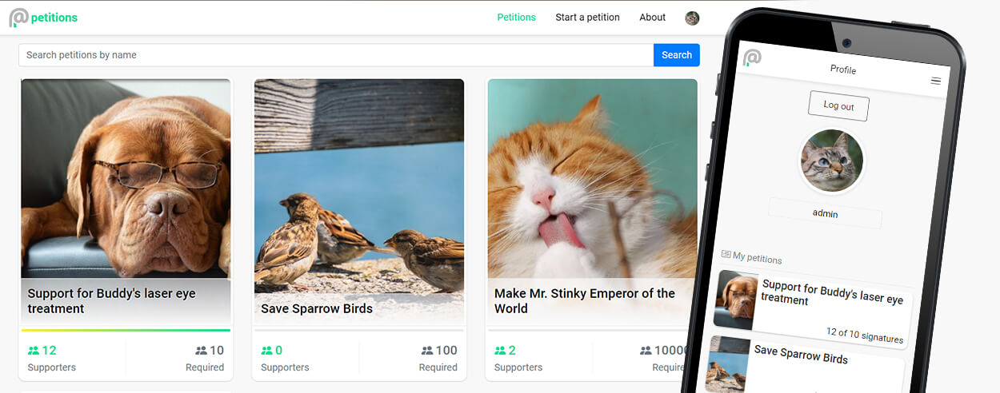

# petitions - a petition platform (React, MeteorJS, Bootstrap)

### See it live [petitions](https://recipan.herokuapp.com/)
-------------
Notice! First start delay is about 20 seconds because of Heroku hosting cold start on the free packet.

### About
-------------
- built with React and Meteor;
- registered users can create petitions, everybody can sign them;
- sharing petitions via social media and QR codes...
